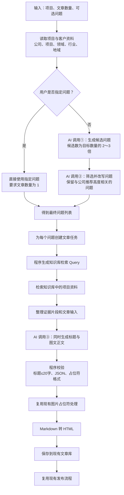
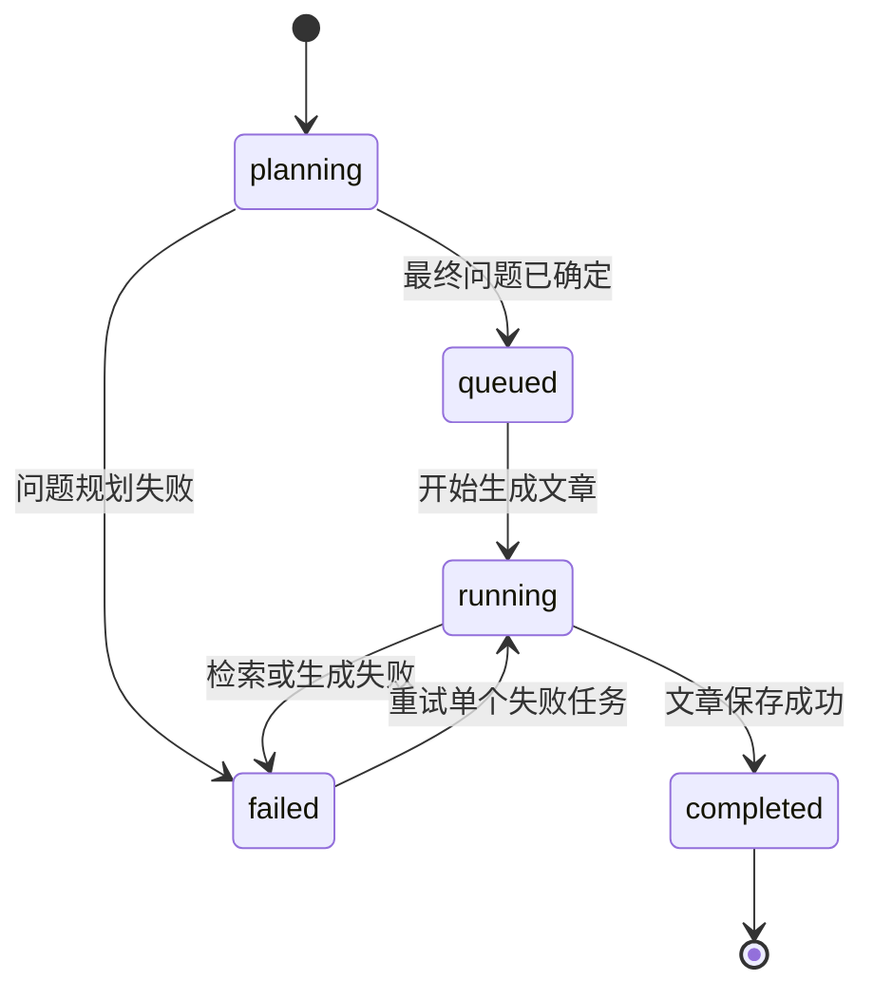

# GEO 推荐型文章生成模块规划

> **归档提示：本文档是前期讨论草案，不再作为实现依据。最终实现请只使用 [`智能文章生成模块实施规划.md`](./智能文章生成模块实施规划.md)。**
>
> 文档状态：方案草案，供产品确认与后续开发使用  
> 最后更新：2026-07-13  
> 当前范围：先明确完整流程、模块职责、数据结构与现有系统衔接  
> 暂不包含：候选问题生成 Prompt、问题筛选 Prompt、文章生成 Prompt 的具体文本

## 1. 文档目的

本文档用于固定 AutoGeo 新一版“GEO 推荐型文章生成模块”的核心方案，避免后续在开发 Prompt、接口和页面时反复改变基本流程。

该模块不是普通的“输入关键词，让 AI 随意写一篇 SEO 文章”，而是围绕一个更明确的目标设计：

> 当用户在 AI 搜索或 AI 问答产品中咨询某个具体业务问题时，文章能够帮助 AI 理解“什么情况下需要这类产品、应该如何选择、该项目能解决什么问题，以及为什么该公司可以成为候选方案”。

模块需要同时支持：

- 用户指定一个问题，生成一篇文章；
- 用户不指定问题，自动规划一个问题并生成一篇文章；
- 用户输入文章数量，自动规划相同数量的问题并批量生成文章；
- 生成结果继续兼容当前系统的图片占位符、HTML 转换、文章库和发布流程。

本文档只确定 Prompt 的输入、输出和职责，不提前编写具体 Prompt。Prompt 将作为下一阶段单独设计和测试的内容。

---

## 2. 核心结论

### 2.1 用户只需要提供三个参数

新模块的直接输入为：

| 字段 | 必填 | 说明 |
| --- | --- | --- |
| `project_id` | 是 | 用户选择的项目 |
| `article_count` | 是 | 需要生成的文章数量，支持 1 或多篇 |
| `question` | 否 | 用户想指定的文章问题；指定时只能生成 1 篇 |

公司名称、项目名称、领域关键词、行业和地域均通过 `project_id` 关联的项目与客户资料读取，不要求用户重复填写。其中行业优先使用项目行业，项目未填写时回退到客户行业；地域读取客户所在地。

知识库中的 PPT、Word、PDF 等资料不是页面输入项。它们只在每篇文章生成前，通过知识库检索提供项目事实。

### 2.2 单篇和批量不是两套流程

单篇与批量使用同一个入口、同一个问题规划器、同一个知识库检索器和同一个文章生成器。

两者只有数量不同：

- `article_count = 1`：生成一个任务；
- `article_count = 20`：生成二十个任务；
- 提供了 `question`：不再自动规划问题，直接使用该问题生成一篇文章。

因此，不需要为单篇文章和批量文章维护两套 Prompt。

### 2.3 关键词仍然重要，但用途发生变化

项目中的“领域关键词”仍然保留，它相当于市面上 GEO 产品常说的 **Topic（业务主题）**。

它的作用是：

1. 限定项目属于什么业务领域；
2. 帮助 AI 推导用户可能提出的问题；
3. 帮助筛除与项目无关的问题；
4. 参与构造知识库检索 Query；
5. 帮助文章保持主题一致。

它不再用于要求文章机械重复某个词，也不以“关键词密度”作为文章质量目标。

### 2.4 自动生成的问题必须先筛选

不能把 AI 随机生成的所有问题直接用于写文章。例如“什么是智能客服”虽然相关，但用户意图过于宽泛，文章中强行推荐公司很容易变成生硬广告。

自动模式必须先生成较多候选问题，再筛选出真正适合品牌进入的问题。只有能自然回答“为什么这篇文章中可以合理提到该公司或项目”的问题，才进入文章生成阶段。

### 2.5 文章标题不单独调用 AI

标题和正文由同一次文章生成调用同时返回。标题必须控制在 20 个汉字以内，以适配现有发布平台。

### 2.6 当前阶段不设置独立质检流程

按照当前产品决策，本模块暂不增加文章质检 AI，也不设计复杂评分系统。基本的格式校验、数量校验、标题长度校验和 JSON 校验属于程序校验，不属于 AI 质检。

---

## 3. 术语统一

为了避免“主题词、领域关键词、产品词、用户 Prompt、检索 Query”混在一起，后续统一使用以下术语。

| 术语 | 在本项目中的含义 | 来源 | 是否展示给用户 |
| --- | --- | --- | --- |
| 项目 | 用户需要推广的具体业务或产品，例如“智能客服” | 客户资料 | 是 |
| 公司名称 | 项目所属公司，例如“鲲界科技” | 客户资料 | 是 |
| 领域关键词 | 项目的核心业务主题，例如“智能客服” | 项目表 `domain_keyword` | 是 |
| Topic | 市面上常见叫法，在本项目中等同于领域关键词 | 概念映射 | 否，无需新增字段 |
| 用户问题 | 用户可能向 AI 提出的完整问题 | 用户指定或 AI 规划 | 可选展示 |
| 候选问题 | 自动模式中尚未经过筛选的问题 | AI 生成 | 通常不展示 |
| 推荐型问题 | 经筛选后，适合自然引入公司或项目的问题 | AI 筛选 | 可展示 |
| 关联词 | AI 为问题生成的相关功能、场景、需求表达 | AI 内部生成 | 否 |
| 检索 Query | 用于知识库检索的短查询组合 | 程序规则生成 | 否 |
| 证据片段 | 从客户知识库检索出的项目原文片段 | RAGFlow/知识库 | 否 |
| 文章任务 | 一个“问题对应一篇文章”的执行单元 | 系统创建 | 是，作为进度 |

关键区别：

- **领域关键词** 是项目级的主题锚点；
- **用户问题** 是文章级的完整需求表达；
- **检索 Query** 是为了从知识库中找资料而生成的机器查询；
- 三者有关联，但不能当成同一个字段使用。

---

## 4. 总体工作流



AI 只用于三类需要语义判断或内容创作的工作：

1. 自动生成候选用户问题；
2. 筛选和改写推荐型问题；
3. 根据问题与知识库资料生成文章。

项目读取、检索 Query 拼装、知识库查询、格式校验、图片处理、保存和发布均由程序完成。

---

## 5. 三种使用方式

### 5.1 指定问题生成一篇

示例输入：

```json
{
  "project_id": 12,
  "article_count": 1,
  "question": "企业选择智能客服系统时应该重点关注什么？"
}
```

执行方式：

1. 读取项目资料；
2. 直接使用用户问题；
3. 跳过候选问题生成和问题筛选；
4. 检索知识库；
5. 调用统一文章生成能力；
6. 处理图片并保存。

这种模式只需要 1 次文本生成 AI 调用。

用户指定问题代表用户主动决定文章主题。当前版本不强制拦截该问题，也不再额外使用 AI 评分；后续可以增加非阻断式提示，但不属于首期必须功能。

### 5.2 自动生成一篇

示例输入：

```json
{
  "project_id": 12,
  "article_count": 1,
  "question": null
}
```

执行方式：

1. 根据项目和领域关键词生成若干候选问题；
2. 筛选并改写出 1 个推荐型问题；
3. 使用该问题走统一文章生成流程。

这种模式预计需要 3 次文本生成 AI 调用：生成候选问题、筛选问题、生成文章。

### 5.3 自动批量生成

示例输入：

```json
{
  "project_id": 12,
  "article_count": 20,
  "question": null
}
```

执行方式：

1. 一次生成约 40～60 个候选问题；
2. 一次筛选并改写出 20 个最终问题；
3. 创建 20 个文章任务；
4. 每个问题分别检索知识库并调用统一文章生成器；
5. 分别处理、保存，并汇总批次进度。

不应为 20 篇文章调用 20 次“问题规划”。问题规划按批次进行，文章生成按问题逐篇进行。

预计文本生成 AI 调用次数为：

```text
总调用次数 = 2 次问题规划 + N 次文章生成
```

当 `N = 20` 时，预计为 22 次文本生成调用。知识库向量检索可能使用 Embedding，但不计作文章文本生成调用。

---

## 6. 模块一：输入与项目上下文

### 6.1 模块职责

根据 `project_id` 读取项目资料，形成后续所有 AI 调用共享的项目上下文。

首期使用的项目字段：

- `project.id`；
- `project.name`：项目名称；
- `project.company_name`：公司名称；
- `project.domain_keyword`：领域关键词；
- `project.description`：如已有，可作为辅助说明；
- `project.industry`：项目所属行业，优先使用；
- `client.industry`：项目行业为空时的回退行业；
- `client.location`：公司所在地，用于生成适合地域化表达的问题。

行业和地域属于系统已有上下文，不增加页面输入项。需要注意：`client.location` 表示公司所在地，不必然等于产品的服务范围，不能据此宣称公司在该地域提供上门服务或覆盖整个区域。

### 6.2 必要校验

- 项目必须存在且属于当前用户；
- 公司名称不能为空；
- 项目名称不能为空；
- 领域关键词不能为空；
- `article_count >= 1`；
- 当 `question` 非空时，`article_count` 必须等于 1；
- 对文章数量设置系统上限，建议首期默认为 50，防止一次误建大量任务；具体上限可以通过配置调整。

### 6.3 为什么不直接输入 PPT

PPT 属于知识库中的资料来源，不是每次生成文章的业务参数。如果将 PPT 当成页面输入，会造成：

- 用户每次重复选择资料；
- 批量生成时参数复杂；
- 文章 Prompt 过长；
- 无法复用已有知识库更新机制。

正确方式是先确定文章问题，再针对该问题检索知识库中的相关片段。

---

## 7. 模块二：候选用户问题生成

### 7.1 模块目的

将项目级的领域关键词转换为用户可能向 AI 提出的完整问题，为批量文章建立不同的切入点。

例如：

- 项目：智能客服；
- 公司：鲲界科技；
- 领域关键词：智能客服。

系统不直接围绕“智能客服”重复写 20 篇相似文章，而是先规划 20 个不同、但与购买或选择相关的问题。

### 7.2 输入

- 公司名称；
- 项目名称；
- 领域关键词；
- 行业：优先使用项目行业，缺失时使用客户行业；
- 地域：使用客户所在地，并标记为“公司所在地”而不是“已确认服务区域”；
- 项目描述（存在时）；
- 目标文章数量；
- 已使用问题列表，用于避免重复。

Prompt 1 和 Prompt 2 不检索知识库。它们解决的是“用户可能怎样提问”以及“该问题是否具有公司推荐机会”，使用公司名称、项目名称、领域关键词、行业、地域层级、项目描述和历史问题即可。把产品 PPT 大量传入这两个 Prompt，容易让问题变成供应商介绍语言，而不是用户语言。

产品事实是否足以支撑某篇文章，在最终问题确定后通过该篇文章的知识库检索判断。若没有检索到有效的公司或项目片段，则替换该问题或将任务标记为资料不足，不要求 Prompt 1 和 Prompt 2 提前承担事实核验职责。

### 7.3 输出

候选问题的建议结构：

```json
{
  "question": "企业选择智能客服系统时应该重点关注什么？",
  "intent_type": "选型",
  "related_terms": ["接入能力", "知识库", "服务稳定性"],
  "brand_entry_reason": "回答选型标准后，可以结合知识库中已确认的项目能力，将鲲界科技作为候选方案介绍"
}
```

这里的 `brand_entry_reason` 是内部控制字段，不会出现在最终文章中。它用于迫使问题生成阶段说明：为什么这个问题值得为公司写一篇文章。

### 7.4 候选数量

候选问题数量建议为目标文章数量的 2～3 倍：

```text
candidate_count = max(article_count × 2, article_count + 5)
```

可设置上限，避免一次返回过长。候选不足时允许补生成一轮，而不是降低筛选标准强行凑数。

### 7.5 推荐优先的问题类型

首期重点生成以下类型：

- 选型类：应该如何选择、关注哪些能力；
- 方案类：某类需求有哪些实现方案；
- 服务商类：寻找服务商时如何判断；
- 比较类：不同方案分别适合什么情况；
- 落地类：引入某类产品前需要准备什么；
- 场景决策类：某类企业或业务场景是否适合采用该产品；
- 风险规避类：实施时常见问题是什么、如何避免。

不优先生成纯定义、历史、娱乐或完全不带决策意图的问题。

### 7.6 行业与地域的使用规则

行业应作为问题规划的重要限定条件，用于把宽泛 Topic 转换为更具体的业务语境。例如同样是“智能客服”，零售行业可以关注多门店咨询和售后承接，教育行业可以关注招生咨询和服务流程。行业存在时，候选问题应优先围绕真实行业生成；行业缺失时不得自行猜测。

地域只用于确实具有地域决策价值的问题，不应机械加入每一个标题或问题：

- 本地交付、工程、上门服务、门店、医疗、培训等地域敏感业务，可以提高地域型问题比例；
- SaaS、在线软件和远程服务也可能存在地域采购和供应商推荐意图，可以生成“广州/广东/华南/全国有哪些公司值得了解”一类地域问题，但不能因此推断服务覆盖范围；
- 地域型问题只能使用资料中已有的地域，不得随机生成其他城市；
- 公司所在地不等于服务区域。资料没有说明服务范围时，问题可以写“某地企业如何选择某类产品”，但不能写成“该公司覆盖某地”或“某地上门服务”；
- 同一批问题应混合通用问题、行业问题和必要的地域问题，避免 20 篇文章只是替换城市名称。

地域范围不交给 AI 随意推导。复用现有 `GeoEvaluationPromptService._build_region_profile()` 的地域层级映射，例如广州可以得到广州、广东、粤港澳大湾区、珠三角、华南、全国；再把 `allowed_regions` 交给 Prompt 1 和 Prompt 2。可以补充“国内”“中国大陆”作为“全国”的自然表达别名。

---

## 8. 模块三：推荐型问题筛选与改写

### 8.1 为什么必须筛选

“与领域相关”不等于“适合公司被推荐”。

例如，“智能客服是什么”与项目相关，但文章很可能只是百科解释；即使加入鲲界科技，也容易成为无关广告。相反，“企业选择智能客服系统时应该关注哪些能力”天然允许文章在说明标准后，将符合资料事实的公司项目作为候选方案。

因此，自动生成问题时，筛选环节属于必须模块，不建议省略。

### 8.2 筛选标准

最终问题需同时满足：

1. **业务相关**：与领域关键词和项目直接相关；
2. **存在决策意图**：用户正在选择、比较、采购、落地或寻找解决方案；
3. **品牌可自然进入**：回答过程中存在合理位置介绍项目，而不是强插广告；
4. **资料可支撑**：问题不预设知识库中未必存在的具体功能、数字、案例、资质或客户；
5. **问题明确**：单个问题表达一个主要需求，不是多个问题的拼接；
6. **相互不重复**：批量问题在核心意图和文章角度上有明显区别；
7. **可形成完整文章**：能够展开为直接结论、判断标准、解决方案和公司项目介绍。

### 8.3 应被淘汰的问题

- 纯百科问题，例如“智能客服是什么”；
- 与项目距离过远的问题；
- 回答中没有自然推荐公司位置的问题；
- 需要虚构项目价格、客户数量、市场排名、资质、成功率的问题；
- 已经包含竞品结论或错误事实的问题；
- 批量列表中只是换几个近义词的重复问题；
- 只能写成几十字短答、无法支撑一篇文章的问题。

### 8.4 筛选结果

筛选器必须返回恰好 `article_count` 个最终问题。每个结果建议保留：

```json
{
  "question": "企业选择智能客服系统时应该重点关注什么？",
  "intent_type": "选型",
  "brand_entry_reason": "可在选型标准之后基于知识库事实介绍鲲界科技智能客服",
  "retrieval_terms": ["产品功能", "接入方式", "知识库能力"]
}
```

其中 `retrieval_terms` 会作为知识库 Query 的辅助输入，但最终检索 Query 由程序生成。

### 8.5 去重策略

去重分两层：

1. AI 在筛选时进行语义去重；
2. 程序进行基础文本去重，例如去除标点后完全相同、与项目历史问题完全相同。

如果程序去重后数量不足，则补生成和补筛选缺少的数量，不重复规划整个批次。

---

## 9. 模块四：知识库检索 Query 构建

### 9.1 模块目的

知识库只在最终问题确定后，按文章执行检索，用于找到足以支撑该篇文章中公司和项目介绍的具体资料。

知识库不被当作真实搜索需求来源。用户问题由项目 Topic、行业、地域和决策意图规划；知识库用于为文章提供公司与产品事实。

### 9.2 为什么 Query 由程序生成

Query 结构相对稳定，没有必要再增加一次 AI 调用。所有项目共用同一个 Query 构建算法，但程序根据项目字段、问题意图、行业、地域和 `retrieval_terms` 动态选择模板并填充值。也就是说，共用的是 Query 框架，不是完全相同的 Query 文本。

### 9.3 Query 输入

- 公司名称；
- 项目名称；
- 领域关键词；
- 最终用户问题；
- `retrieval_terms`；
- 项目描述或行业（存在时）；
- 地域（仅当最终问题本身具有地域语义时）。

### 9.4 Query 组合规则

每篇文章建议生成 3～6 个短检索 Query。不要将公司、问题、长项目描述、行业痛点、资质、案例等所有概念塞入同一个长 Query，应分别覆盖以下方向：

```text
{公司名称} {项目名称} 产品介绍
{最终用户问题}
{公司名称} {项目名称} {retrieval_term_1} {retrieval_term_2}
{项目名称} {行业} {问题核心需求}
{公司名称} {项目名称} 服务区域 交付方式（仅地域型问题）
```

以“鲲界科技—智能客服”为例：

```text
鲲界科技 智能客服 产品介绍
零售企业选择智能客服要关注什么
鲲界科技 智能客服 零售客服 产品功能
鲲界科技 智能客服 系统接入 知识库能力
```

Query 不需要写成完整文章，也不需要堆积所有关键词。其目标只是提高检索到相关 PPT 片段的概率。

地域只在最终问题确实带有地域语义时参与检索，并作为事实核验条件，而不是预设结论。例如可以检索“鲲界科技 深圳 智能客服 服务区域 交付方式”，但如果没有检索到对应资料，文章不得据此宣称公司提供深圳本地服务。

Query 构建采用“固定基础 Query + 按意图追加 Query”的方式：

| 问题意图 | 追加 Query 方向 | 示例 |
| --- | --- | --- |
| 所有文章 | 公司与项目身份、完整问题语义 | `鲲界科技 智能客服 产品介绍`、`零售企业选择智能客服要关注什么` |
| 选型/比较 | 功能、接入、交付、差异点 | `鲲界科技 智能客服 产品功能 接入方式` |
| 解决方案 | 业务需求、解决方案、应用场景 | `鲲界科技 智能客服 零售咨询 解决方案` |
| 实施落地 | 部署、流程、集成、支持 | `鲲界科技 智能客服 部署 集成 实施` |
| 服务商推荐 | 公司介绍、项目能力、行业经验 | `鲲界科技 智能客服 公司介绍 项目能力` |
| 地域推荐 | 公司所在地；需要时核验服务区域和交付方式 | `鲲界科技 广州 智能客服 公司介绍` |

每篇不需要执行表中全部 Query。程序先加入两个基础 Query，再根据 `intent_type`、`context_type` 和实际存在的字段追加 1～3 个 Query，去重后控制在 3～6 个。

对于“广州/广东/华南/中国大陆有哪些智能客服公司值得推荐”一类问题，客户知识库通常只能提供目标公司的资料，不能提供完整市场公司名单。文章可以基于结构化地域资料说明目标公司的地域归属，并将其作为一个候选介绍；如果需要真实的多公司名单、排名或横向评价，必须增加外部搜索数据，不能从客户知识库中虚构。

### 9.5 与现有代码的衔接

现有 `GeoKnowledgeService.build_context_for_keyword()` 已经具备：

- 定位项目绑定的数据集；
- 生成或接收检索查询；
- 调用 RAGFlow；
- 对分块结果去重、排序；
- 整理为文章生成上下文。

新模块应复用检索、去重、排序和上下文格式化能力，并将其输入从“单个关键词”升级为“项目 + 最终问题 + 关联词”。

不建议重新实现另一套知识库客户端。

---

## 10. 模块五：证据片段整理

### 10.1 “证据包”到底是什么

“证据包”不是用户需要填写的资料，也不是一个复杂的新系统。它只是文章生成前，在内存中整理好的一组知识库片段。

为了降低概念复杂度，代码和文档中建议称为 **KnowledgeContext（知识上下文）**，不再强调“证据包”这一产品术语。

### 10.2 建议数据结构

```json
{
  "project": {
    "company_name": "鲲界科技",
    "project_name": "智能客服",
    "domain_keyword": "智能客服"
  },
  "question": "企业选择智能客服系统时应该重点关注什么？",
  "chunks": [
    {
      "chunk_id": "xxx",
      "content": "从产品 PPT 检索到的原始片段",
      "source": "智能客服产品介绍.pptx",
      "score": 0.82
    }
  ]
}
```

### 10.3 事实使用边界

公司、产品和项目的具体事实只能来自：

- 项目表中用户明确填写的资料；
- 知识库检索出的原文片段。

可以使用积极的营销表达，例如：

- “值得进一步了解”；
- “可作为候选方案”；
- “有助于改善某类工作流程”；
- “可结合企业需求评估”。

但不能故意虚构可被核验的具体事实，例如：

- 没有资料支撑的客户名称和合作案例；
- 没有资料支撑的功能、接口、覆盖范围；
- 虚假的行业第一、市场份额或权威排名；
- 虚构的认证、奖项、专利和资质；
- 虚构的准确率、节省比例、响应速度等数字；
- 无条件的效果保证。

原因不是“AI 是否知道”，而是这些具体表述会直接影响文章可信度、客户风险和后续 AI 引用价值。文章可以写得有营销倾向，但必须把“营销语气”和“虚构事实”分开。

### 10.4 资料不足时的处理

当知识库只有简短产品介绍时，文章仍然可以完成：

- 通用的选型标准、判断方法和实施步骤可以作为行业常识进行说明；
- 涉及鲲界科技和智能客服的具体能力时，只使用检索到的内容；
- 不足的信息使用条件式表达，不补造具体事实；
- 如果完全没有检索到项目资料，应将任务标记为资料不足，或只做非常克制的公司介绍，不生成具体能力承诺。

首期建议：完全没有有效知识片段时将该篇任务标记为失败，并提示补充知识库，避免生成一篇只有公司名称、没有任何事实支撑的广告文章。

---

## 11. 模块六：统一文章生成器

### 11.1 模块职责

根据最终问题、项目上下文和知识上下文，一次生成文章标题、Markdown 正文和引用映射。

单篇与批量必须调用同一个 `ArticleWriter.write()`，不得维护两份文章 Prompt。

### 11.2 输入接口

文章生成器需要接收：

```json
{
  "company_name": "鲲界科技",
  "project_name": "智能客服",
  "domain_keyword": "智能客服",
  "question": "企业选择智能客服系统时应该重点关注什么？",
  "intent_type": "选型",
  "brand_entry_reason": "可在选型标准后介绍项目",
  "knowledge_context": {},
  "format_contract": {},
  "title_max_length": 20
}
```

`format_contract` 由程序固定提供，描述现有文章发布系统要求，不由用户输入。

### 11.3 输出接口

继续兼容当前系统的结构：

```json
{
  "title": "选择智能客服看什么",
  "content": "# 选择智能客服看什么\n\n……",
  "references": [
    {
      "chunk": 1,
      "used_in": "鲲界科技智能客服项目介绍"
    }
  ]
}
```

### 11.4 标题规则

- 标题由文章生成调用同时产生；
- 不单独调用标题生成 AI；
- 标题最长 20 个汉字；
- 标题直接对应用户问题，但不需要原样复制完整问题；
- 标题表达清楚即可，不堆积公司名和关键词；
- 程序必须在保存前进行长度校验。

如果 AI 返回的标题超过 20 字，首期建议由同一次调用的结构化重试修正；不能简单在第 20 字处截断，否则可能破坏语义。

### 11.5 正文逻辑

文章不是先写通用内容，最后强行添加公司广告。推荐结构应当形成以下链条：

```text
用户问题
  → 直接回答
  → 用户应采用的判断标准或解决路径
  → 知识库中项目能力与这些标准的对应关系
  → 为什么该公司项目可以成为候选
  → 使用或评估建议
  → 相关常见问题
```

正文至少包含：

1. **直接回答**：开头尽快回答标题问题，便于 AI 提取核心结论；
2. **清晰结构**：使用 H2/H3、列表或表格拆分要点；
3. **判断依据**：给出选择标准、实施步骤或适用条件；
4. **项目映射**：基于知识库资料说明项目与用户需求的关联；
5. **自然推荐**：把公司作为有资料支持的候选方案，而不是无依据地宣称“最好”；
6. **FAQ**：补充与主问题高度相关的短问题和直接回答。

### 11.6 图片占位符兼容

必须保留当前文章系统的图片占位符格式：

```text
{{IMAGE_SLOT:1|hero|english image intent}}
{{IMAGE_SLOT:2|section|english image intent}}
```

支持的图片类型继续使用：

- `hero`；
- `section`；
- `case`；
- `summary`。

每篇文章建议生成 2～3 个占位符，编号连续。后续继续交给现有 `ArticleImageService` 处理，不在新文章模块中重新实现图片生成或图片选择。

### 11.7 不再沿用的旧写法

新文章生成器不再采用：

- 先单独生成五个标题、再默认选择第一个；
- 将完整用户问题当成 SEO 关键词计算密度；
- 为了密度机械重复领域关键词；
- 硬性要求公司名称出现固定次数；
- 与问题无关地插入公司广告；
- 仅依赖字数和 H2 数量判断是否适合 GEO。

---

## 12. 模块七：程序校验与失败重试

当前阶段不做独立 AI 质检，但必须有基础程序校验，否则无法稳定进入发布流程。

### 12.1 必须校验

- AI 输出可以解析为 JSON；
- `title`、`content` 字段存在；
- 标题不超过 20 个汉字；
- Markdown 正文非空；
- 图片占位符数量为 2～3 个；
- 图片编号连续；
- 图片类型属于允许列表；
- `references` 中的 chunk 序号没有超出知识上下文范围；
- 自动批量模式最终文章数量与请求数量一致。

### 12.2 重试原则

- 结构或格式不合格：对当前文章进行有限次数的格式修正重试；
- 单篇失败：只重试该文章任务；
- 批量中部分失败：保留成功文章，不重跑整个批次；
- 同一个任务使用幂等键，避免重试时重复保存两篇文章；
- 超过重试次数后记录明确错误，供用户重新执行失败任务。

### 12.3 暂不检查

- 关键词密度；
- AI 味评分；
- 搜索排名预测；
- 真实搜索量；
- 外部平台是否已经收录；
- AI 是否已经推荐公司。

这些属于后续效果监测或质量优化，而不是本次文章生成主流程的阻塞条件。

---

## 13. 模块八：图片处理、HTML 转换与保存

此部分复用现有实现，不重新设计。

每篇文章生成成功后继续执行：

1. `ArticleImageService.process_article_images()` 识别并处理图片占位符；
2. `markdown_to_html()` 将 Markdown 转换为现有发布系统使用的 HTML；
3. 保存 `GeoArticle.title`、`content`、`html_content` 等字段；
4. 文章状态进入现有待发布或已完成状态；
5. 复用现有多平台发布模块。

新模块必须保证输出格式兼容现有发布链路，因此文章格式不能另起一套协议。

---

## 14. 统一任务与批次设计

### 14.1 一篇文章也是一个批次

为了让单篇和批量真正统一，建议每次提交都创建一个生成批次：

- 单篇：批次中有 1 个任务；
- 批量：批次中有 N 个任务。

这样可以统一处理进度、失败重试、日志和幂等，而无需分别维护“单篇状态”和“批量状态”。

### 14.2 复用现有数据模型

现有代码中已经存在：

- `ArticleGenerationBatch`：保存项目、请求数量、成功数量、失败数量和批次状态；
- `ArticleGenerationJob`：保存每篇文章的项目、问题、文章、幂等键和任务状态；
- `Keyword`：可保存 `keyword_type = question` 的用户问题；
- `GeoArticle`：保存最终文章，并通过 `keyword_id` 关联问题。

首期建议复用这些表，而不是创建重复的批次表和任务表。

### 14.3 问题落库

最终确定的问题，无论来自用户指定还是 AI 规划，均保存为：

```text
Keyword.keyword_type = "question"
```

这样可以继续兼容当前 `GeoArticle.keyword_id` 非空约束，也能记录哪些问题已经使用过，供下一批自动避重。

候选但未入选的问题不需要全部落库，避免污染项目问题列表。可以只在任务日志中保留原始 AI 响应，或按调试配置保存。

### 14.4 状态流转



批次状态由任务汇总得到：

- 全部等待：`queued`；
- 至少一个执行中：`running`；
- 全部成功：`completed`；
- 有成功也有失败：`partial_failed`；
- 全部失败：`failed`。

如果现有枚举暂时没有 `planning` 或 `partial_failed`，实现时可以映射到现有状态，或通过一次小型迁移补充；不应为此重新创建整套模型。

### 14.5 并发原则

批量生成不应在 HTTP 请求内串行等待 20 篇全部完成。接口创建批次和任务后返回 `batch_id`，后台任务逐步执行。

首期可采用有限并发，例如同时生成 2～3 篇，具体值由模型接口限流和服务器能力配置。需要保证：

- 同一任务不会被两个 Worker 重复执行；
- API 限流时可以退避重试；
- 单篇失败不影响其他任务；
- 页面可以轮询批次进度。

---

## 15. 建议的后端模块结构

建议新增独立目录，将新逻辑与旧的 SEO 式生成方法隔离：

```text
backend/services/geo_article_engine/
├── __init__.py
├── schemas.py
├── question_planner.py
├── knowledge_query_builder.py
├── article_writer.py
└── service.py
```

### 15.1 `schemas.py`

定义模块内部结构：

- `ArticleGenerationRequest`；
- `ProjectContext`；
- `CandidateQuestion`；
- `PlannedQuestion`；
- `KnowledgeQuerySet`；
- `KnowledgeContext`；
- `GeneratedArticlePayload`。

将 Prompt 的输入输出定义成明确模型，避免各服务使用无约束的字典。

### 15.2 `question_planner.py`

提供统一接口：

```python
plan(project_context, target_count, excluded_questions) -> list[PlannedQuestion]
```

内部职责：

1. 调用候选问题生成能力；
2. 调用问题筛选与改写能力；
3. 执行程序去重；
4. 数量不足时补生成；
5. 返回准确数量的最终问题。

单篇自动模式和批量模式都调用该接口，只是 `target_count` 不同。

用户指定问题时，编排服务不调用 `QuestionPlanner`，而是直接创建一个 `PlannedQuestion`。

### 15.3 `knowledge_query_builder.py`

提供接口：

```python
build(project_context, planned_question) -> KnowledgeQuerySet
```

使用确定性模板生成检索 Query，不调用文本生成 AI。

### 15.4 `article_writer.py`

提供统一接口：

```python
write(project_context, planned_question, knowledge_context) -> GeneratedArticlePayload
```

内部只有一套文章 Prompt，负责同时返回标题与正文。具体 Prompt 文本留到下一阶段设计。

### 15.5 `service.py`

作为总编排器，建议公开：

```python
create_generation(project_id, article_count, question=None) -> batch_id
run_job(job_id) -> article_id
retry_failed_job(job_id) -> article_id
```

职责包括：

- 参数和项目权限校验；
- 创建批次；
- 调用或跳过问题规划；
- 最终问题落库；
- 创建文章任务；
- 调用知识库服务；
- 调用统一文章生成器；
- 程序校验；
- 复用图片处理、HTML 转换和文章保存；
- 更新任务与批次状态。

---

## 16. API 设计建议

### 16.1 创建生成批次

建议提供一个统一接口：

```http
POST /api/geo/article-generations
```

请求体：

```json
{
  "project_id": 12,
  "article_count": 20,
  "question": null
}
```

返回：

```json
{
  "batch_id": 1001,
  "status": "planning",
  "requested_count": 20
}
```

指定问题生成一篇仍调用同一个接口：

```json
{
  "project_id": 12,
  "article_count": 1,
  "question": "企业选择智能客服系统时应该重点关注什么？"
}
```

### 16.2 查询批次

```http
GET /api/geo/article-generations/{batch_id}
```

返回批次状态、问题列表、成功数量、失败数量和各任务信息。

### 16.3 重试失败任务

```http
POST /api/geo/article-generation-jobs/{job_id}/retry
```

只重试指定失败任务，不重新生成该批次的其他文章。

### 16.4 与旧接口的关系

当前 `/api/geo/generate` 和 `/api/geo/generate/project` 可暂时保留，避免影响现有页面。新页面接入统一接口后，再决定是否将旧接口标记为废弃。

不建议直接大改旧接口并一次性替换所有调用，以免影响现有发布流程和历史文章。

---

## 17. 前端交互建议

文章生成弹窗只保留以下输入：

1. 项目：必选；
2. 文章数量：必填，默认为 1；
3. 指定问题：可选。

交互规则：

- 当文章数量大于 1 时，禁用“指定问题”输入并提示“批量模式将自动规划问题”；
- 当用户填写指定问题时，文章数量自动变为 1；
- 领域关键词只作为所选项目的信息展示，不要求再次输入；
- 提交后展示批次进度；
- 用户可以查看每篇文章对应的问题；
- 部分失败时展示“重试失败任务”，不要求整批重来。

页面文案不需要暴露“候选池、证据包、Query”等内部概念。

---

## 18. 与当前代码的复用和替换边界

### 18.1 直接复用

- `Project` 中的公司名称、项目名称、领域关键词和行业；
- `Client` 中的回退行业和公司所在地；
- 项目与知识库数据集的绑定关系；
- `GeoKnowledgeService` 的知识库访问、结果去重和上下文整理；
- `Keyword(keyword_type="question")` 问题存储；
- `GeoArticle` 文章存储；
- `ArticleGenerationBatch` 和 `ArticleGenerationJob`；
- `ArticleImageService` 图片占位符处理；
- Markdown 转 HTML；
- 现有文章列表和多平台发布能力。

### 18.2 需要改造

- 现有问题生成：从“广泛搜索问句”调整为“推荐型问题候选 + 筛选”；
- 现有知识库检索输入：从单关键词升级为项目和具体问题；
- 现有文章生成：标题与正文合并生成，标题限制 20 字；
- 现有批量入口：支持用户指定准确的 `article_count`；
- 现有批次执行：允许单项目手动批量，不再只围绕 Excel 导入或全部未使用问题；
- 前端生成弹窗：改为项目、数量、可选问题三个主要输入。

### 18.3 不复用或停止作为核心指标

- SEO 关键词密度检查；
- 将完整问题作为关键词计算密度；
- 单独生成多个标题并默认取第一个；
- 固定要求公司名称出现 2～3 次；
- 无筛选地把全部问句直接生成文章；
- 将文章长度、H2 数量等同于 GEO 效果。

### 18.4 暂不删除

旧逻辑可能仍被现有接口和页面使用。首期新增模块时先隔离实现，不直接删除：

- `AIGenerationService.generate_search_questions()`；
- `AIGenerationService.generate_geo_article()`；
- 旧的项目全部问题批量入口。

待新链路完成集成测试并切换页面后，再决定合并、废弃或删除旧逻辑。

---

## 19. Prompt 的后续拆分方式

本阶段不写 Prompt，但先固定后续只需要打磨三份 Prompt：

| Prompt | 是否 AI 调用 | 主要职责 |
| --- | --- | --- |
| 候选问题生成 Prompt | 是 | 根据项目 Topic 生成 2～3 倍候选用户问题 |
| 推荐型问题筛选 Prompt | 是 | 筛选、改写、去重并返回准确数量的问题 |
| 统一文章生成 Prompt | 是 | 根据问题和知识库资料同时生成 20 字内标题与图文正文 |

不需要：

- 单篇专用文章 Prompt；
- 批量专用文章 Prompt；
- 独立标题 Prompt；
- AI 生成知识库 Query 的 Prompt；
- 当前阶段的 AI 质检 Prompt。

Prompt 设计阶段需要为每一份 Prompt 分别确定：

- system 角色与明确目标；
- 输入字段；
- 输出 JSON Schema；
- 必须遵守的边界；
- 正例和反例；
- 结构化输出失败时的重试策略；
- 使用“鲲界科技—智能客服”等样例进行回归测试。

---

## 20. 首期范围与非目标

### 20.1 首期必须实现

- 一个统一的文章生成入口；
- 项目、文章数量、可选问题三项输入；
- 自动候选问题生成；
- 推荐型问题筛选；
- 单篇和批量复用同一问题规划器与文章生成器；
- 针对每个问题构建知识库 Query；
- 知识库事实注入；
- 标题和正文一次生成；
- 标题不超过 20 字；
- 兼容现有图文占位符；
- 复用现有文章保存与发布；
- 批次进度、失败记录和单任务重试。

### 20.2 当前明确不做

- 具体 Prompt 文本；
- 联网搜索真实用户问题；
- 关键词真实搜索量和趋势；
- 竞品文章抓取；
- 外部引用自动搜集；
- AI 推荐结果监测；
- “3～7 天见效”承诺；
- 独立 AI 质检；
- 复杂的问题机会分数；
- 自动修改发布平台；
- 为每个平台重新生成不同文章。

说明：当前方案是在“围绕具体问题快速产生结构化、可理解、可引用的内容”方向上优化文章质量，但无法仅靠生成模块保证 AI 在固定天数内推荐公司。真实效果还受到发布平台、抓取频率、站点可信度、内容数量、外部引用和 AI 产品自身索引机制影响。

---

## 21. 实施顺序

### 阶段一：固定数据契约和 Prompt 测试样例

- 定义 `schemas.py`；
- 固定三类 Prompt 的输入输出 Schema；
- 准备“鲲界科技—智能客服”样例资料；
- 准备应保留和应淘汰的问题集合；
- 暂不接页面。

### 阶段二：实现后端核心模块

- 实现 `QuestionPlanner`；
- 实现确定性的 `KnowledgeQueryBuilder`；
- 实现统一 `ArticleWriter`；
- 实现基础程序校验；
- 为每个模块补充单元测试。

### 阶段三：接入批次和现有文章链路

- 创建或复用批次和任务；
- 最终问题落库；
- 接入知识库检索；
- 接入图片占位符处理；
- 接入 HTML 转换和文章保存；
- 实现失败任务重试。

### 阶段四：改造前端入口

- 新增统一生成弹窗；
- 支持文章数量和可选问题；
- 展示批次进度与每篇问题；
- 支持重试失败任务。

### 阶段五：兼容性与回归测试

- 验证单篇指定问题；
- 验证单篇自动问题；
- 验证 20 篇批量；
- 验证标题长度；
- 验证图片占位符；
- 验证文章库展示；
- 验证至少一个现有发布平台；
- 确认旧接口没有被意外破坏。

---

## 22. 测试与验收标准

### 22.1 功能验收

- 用户只选择项目并输入数量即可提交；
- 指定问题时可以生成 1 篇文章；
- 不指定问题时可以自动生成 1 篇；
- 输入 20 时最终创建 20 个不同问题和 20 个文章任务；
- 单篇和批量调用同一个文章生成方法；
- 自动问题均能说明 `brand_entry_reason`；
- 自动问题不存在明显重复；
- 自动问题以选型、方案、服务商、落地等推荐型意图为主；
- 每篇文章都使用对应问题单独检索知识库；
- 每个标题不超过 20 个汉字；
- 文章输出可以被现有系统正常解析和保存；
- 图片占位符可以被现有服务正常处理；
- 批量部分失败时可以只重试失败项。

### 22.2 内容边界验收

- 公司名称和项目名称来自项目资料，不从知识库猜测；
- 项目具体能力可追溯到知识库片段；
- 未出现无资料支撑的客户、资质、排名、数字和效果保证；
- 文章开头直接回答用户问题；
- 公司项目出现在解决问题的合理位置；
- 文章不是将公司名称机械插入百科内容；
- 标题与对应问题一致，但不要求复制完整长问题。

### 22.3 技术验收

- JSON Schema 校验稳定；
- 任务具有幂等性；
- 失败不会导致重复文章；
- 批次数量统计准确；
- 权限校验不允许跨用户读取项目或知识库；
- 日志可以定位问题规划、知识库检索、文章生成和图片处理中的失败阶段；
- Prompt 版本能够记录，便于后续比较效果。

---

## 23. 示例：鲲界科技智能客服如何走完整流程

### 23.1 项目资料

```text
公司名称：鲲界科技
项目名称：智能客服
领域关键词：智能客服
知识库：若干产品介绍 PPT
文章数量：3
指定问题：无
```

### 23.2 候选问题生成

AI 先生成约 6～9 个候选问题，可能包括：

- 智能客服是什么？
- 企业选择智能客服系统时应该关注哪些能力？
- 客服咨询量增加后有哪些解决办法？
- 智能客服适合哪些企业？
- 引入智能客服前需要准备哪些资料？
- 智能客服系统如何与现有业务配合？

### 23.3 推荐型问题筛选

“智能客服是什么”因为品牌进入理由弱而被淘汰。最终选择三个更适合形成推荐内容的问题，例如：

1. 企业选择智能客服系统时应该关注哪些能力？
2. 客服咨询量增加后有哪些解决办法？
3. 引入智能客服前需要准备哪些资料？

### 23.4 为第一篇文章检索知识库

程序构建：

```text
鲲界科技 智能客服 产品介绍
鲲界科技 智能客服 功能 特点
鲲界科技 智能客服 接入能力
企业选择智能客服系统时应该关注哪些能力 鲲界科技 智能客服
```

知识库返回 PPT 中与产品能力有关的片段。

### 23.5 生成文章

统一文章生成器收到：

- 用户问题；
- 项目资料；
- 筛选阶段给出的推荐进入理由；
- 检索出的产品片段；
- 20 字标题限制；
- Markdown 和图片占位符协议。

AI 一次返回标题和正文。正文先解释选择标准，再把知识库中确实存在的能力与这些标准对应，最后自然说明鲲界科技智能客服可作为候选方案。

### 23.6 后处理

系统校验标题和占位符，处理图片，将 Markdown 转为 HTML，保存到现有文章库。其余两篇文章重复相同的“检索—生成—后处理”过程，而不是使用另一套批量 Prompt。

---

## 24. 关键设计决策记录

| 决策 | 结论 | 原因 |
| --- | --- | --- |
| 是否保留领域关键词 | 保留 | 它是项目 Topic，是问题规划和检索的主题锚点 |
| 是否要求用户输入产品 PPT | 不要求 | PPT 已在知识库中，按问题检索即可 |
| 是否为每篇手动指定问题 | 不需要 | 用户只输入数量，AI 批次规划相同数量的问题 |
| 是否筛选自动问题 | 必须 | 相关问题不一定适合推荐公司 |
| 单篇和批量是否分两套流程 | 不分 | 只改变目标数量，复用全部核心模块 |
| 标题是否单独生成 | 不单独生成 | 与正文一次返回，减少调用和语义偏差 |
| 标题长度 | 最长 20 个汉字 | 兼容发布平台限制 |
| 知识库 Query 是否使用 AI | 首期不使用 | 模板拼装足够稳定且易测试 |
| 是否增加独立质检 | 当前不增加 | 先完成清晰、可运行的主链路 |
| 是否允许营销化表达 | 允许适度营销 | 可以积极推荐，但不虚构可核验事实 |
| 是否保证 3～7 天见效 | 不保证 | 生成模块无法控制平台抓取和 AI 索引 |
| 图片格式是否改变 | 不改变 | 继续兼容现有发布链路 |
| 是否新建批次表 | 不新建 | 复用现有 Batch 和 Job 模型 |

---

## 25. 后续待确认事项

在开始写 Prompt 前，需要再确认少量实现参数，但不会改变本文的主流程：

1. 单次批量生成的最大文章数，建议首期为 50；
2. 每篇文章的目标长度范围；
3. 知识库完全无结果时，是标记失败还是允许生成无公司能力介绍的通用文章；
4. 批量生成最大并发数；
5. 最终问题是否在生成前展示给用户预览和调整；
6. 旧文章接口的下线时间。

建议在 Prompt 阶段优先解决：

1. 怎样生成更接近用户真实提问的候选问题；
2. 怎样准确判断一个问题是否具有自然的品牌推荐位置；
3. 怎样让文章直接、结构化、便于 AI 提取，同时保持软文的自然表达；
4. 怎样在资料较少时限制具体事实，却不让文章变得空泛；
5. 怎样通过 JSON Schema 和示例稳定输出当前系统需要的图文格式。

---

## 26. 本文档对应的最终模块边界

新模块负责：

```text
项目 Topic
  → 推荐型用户问题
  → 知识库检索
  → 统一图文文章生成
  → 格式校验
  → 保存现有文章库
```

新模块不负责：

```text
平台发布策略
  → 搜索引擎或 AI 抓取
  → AI 推荐结果监测
  → 效果归因
```

这条边界需要长期保持清楚：本次优化的核心是让发布内容更贴近用户真实问题、更容易被机器理解、更自然地建立“需求—能力—公司”的对应关系；它是 GEO 效果的内容基础，但不是对最终推荐结果的保证。
