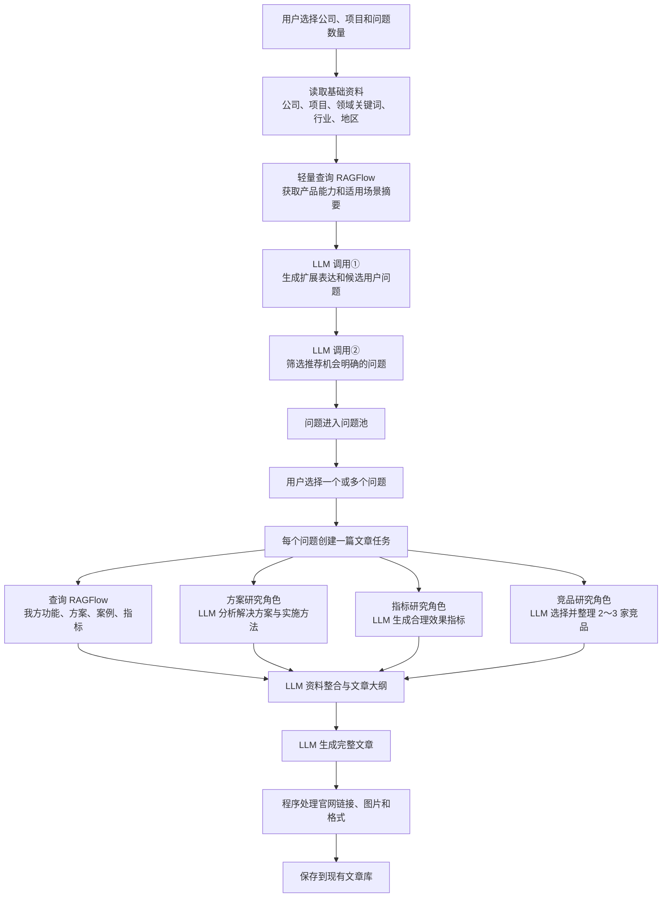

# 智能文章生成模块多角色研究写作优化方案

> 文档状态：待开发实施方案  
> 适用分支：`article_dev`  
> 最后更新：2026-07-30  
> 模型方案：DeepSeek-v4-flash  
> 外部搜索：首期不接入  
> 前端交互：保持现有“生成问题 → 选择问题 → 生成文章”流程

## 1. 文档目的

本文档用于确定智能文章生成模块下一阶段的写作优化方案。

本次优化不改变用户现有操作方式，重点解决以下问题：

1. 生成的文章过于集中介绍目标公司，像企业宣传稿；
2. 用户问题虽然被传入文章 Prompt，但没有真正成为文章主线；
3. 文章缺少行业方案、效果指标和竞品信息，可信度与可读性不足；
4. DeepSeek-v4-flash 不能直接浏览网页，暂时无法进行真实的在线竞品和指标调研；
5. RAGFlow 已经保存公司资料，但需要明确它在问题生成和文章生成中的使用位置；
6. 公司官网只需要作为文章链接使用，不能误认为模型可以通过网址读取官网内容。

本方案的核心目标是：

> 让每个被选中的用户问题驱动一次完整的资料准备过程，再由 DeepSeek-v4-flash 结合 RAGFlow、方案研究、指标研究和竞品研究结果，生成一篇以用户需求为主线、以目标公司为重点、同时包含竞品和数据的 GEO 推荐型文章。

### 1.1 与现有规划的关系

本文件是 [`智能文章生成模块实施规划.md`](./智能文章生成模块实施规划.md) 的增量优化方案，主要替代或扩展以下部分：

- 问题生成时使用的项目上下文；
- 文章生成前的资料准备方式；
- 文章 Prompt 的输入结构；
- 文章内容结构和写作规则；
- DeepSeek-v4-flash 的调用编排。

现有问题池、问题批次、文章任务、图片处理、文章保存和发布流程继续有效，不需要按照本文件重新设计。

---

## 2. 已确认的产品决策

### 2.1 保留现有操作流程

用户继续按照当前页面进行操作：

1. 选择所属公司；
2. 选择关联项目；
3. 输入希望生成的问题数量；
4. 或者直接填写一个明确问题；
5. 点击“生成用户问题”；
6. 在问题池中选择一个或多个问题；
7. 点击生成文章；
8. 每个被选中的问题生成一篇文章。

问题数量只控制本次生成多少个候选问题，不直接等于文章数量。最终文章数量由用户勾选的问题数量决定。

### 2.2 首期只使用 DeepSeek-v4-flash

首期不接入 Tavily、博查、Bing、Serper 等外部搜索 API，也不依赖 DeepSeek 的网页端搜索能力。

所谓“方案研究 Agent、指标研究 Agent、竞品研究 Agent”，首期均为后端发起的独立 LLM 研究任务。三个任务使用相同的 DeepSeek-v4-flash 模型，但采用不同的角色 Prompt、输入和结构化输出。

因此，首期的“研究”含义是：

- 使用模型已有知识分析常见解决方案；
- 使用模型已有知识生成合理的行业指标；
- 使用模型已有知识选择和介绍 2～3 家竞品；
- 不声称这些资料来自实时网页搜索。

### 2.3 RAGFlow 不是 Agent

RAGFlow 是目标公司和目标项目的内部资料来源，不作为一个独立 Agent。

它有两个使用位置：

1. 生成用户问题前，查询一份简短的项目能力摘要，让问题更贴近产品；
2. 生成文章前，围绕当前用户问题查询项目功能、实现方案、案例和效果指标。

### 2.4 官网不参与问题生成

DeepSeek-v4-flash 无法仅凭一个网址读取网页内容，所以公司官网不传入问题生成 Prompt，也不作为产品知识来源。

官网的用途只有一个：

> 在最终文章第一次出现目标公司名称时，将公司名称渲染为指向官网的链接。

例如：

```markdown
[鲲界科技](https://www.example.com)推出的智能客服项目……
```

后续再次出现公司名称时不需要重复添加链接。

### 2.5 不增加文章质量监测

本次不增加独立的文章质量评分、事实审查或 AI 质检流程。

仍然保留程序层面的基础校验，例如：

- JSON 是否可以解析；
- 标题是否符合现有长度限制；
- 正文是否存在；
- 图片占位符格式是否正确；
- 首次公司名称是否带官网链接；
- 竞品数量是否为 2～3 家。

这些属于格式和完整性校验，不属于文章质量监测。

---

## 3. 总体工作流



工作流分为两个阶段：

- 阶段一：生成用户问题；
- 阶段二：围绕用户选择的问题生成文章。

---

## 4. 项目上下文

### 4.1 基础字段

系统根据用户选择的项目读取以下字段：

| 字段 | 来源 | 问题生成 | 文章生成 | 说明 |
| --- | --- | --- | --- | --- |
| 公司名称 | 项目或客户 | 是 | 是 | 作为内部背景，用户问题中不强制出现 |
| 项目/产品名称 | 项目 | 是 | 是 | 必须保留，用于关键词蒸馏和文章主题锚定 |
| 领域关键词 | 项目 | 是 | 是 | 用于拓展用户提问角度和研究主题 |
| 所属行业 | 项目或客户 | 是 | 是 | 用于生成行业化问题、方案和指标 |
| 公司所在地 | 客户 | 是 | 是 | 只在地域需求自然时使用 |
| 官方网站 | 客户 | 否 | 是 | 只用于目标公司首次出现时添加链接 |
| 公司/产品资料 | RAGFlow | 摘要使用 | 详细使用 | 内部事实和项目能力来源 |

### 4.2 官网字段改造要求

当前上下文构建器需要补充读取 `Client.website`，并将其加入文章上下文对象。

建议新增字段：

```python
website: str
```

官网地址进入文章写作或后处理阶段，不进入问题生成 Prompt，也不要求模型访问该网址。

### 4.3 RAGFlow 查询失败时的降级

RAGFlow 查询失败、没有数据集或没有有效片段时：

- 问题生成继续使用项目基础字段；
- 文章生成继续使用三个 LLM 研究角色；
- 不阻断用户生成文章；
- 记录知识库为空的内部状态，便于排查。

---

## 5. 阶段一：用户问题生成

### 5.1 目标

生成真实用户可能向 AI 提出的自然问题，并确保文章回答该问题时，可以自然介绍目标公司、目标项目和相关竞品。

用户问题不是关键词，也不是宣传标题。例如：

```text
中小企业部署智能客服能提升多少效率？
广州有哪些适合制造企业的智能客服服务商？
支持私有化部署的智能客服产品应该怎么选？
制造企业上线智能客服需要准备哪些数据和流程？
```

不优先生成：

```text
什么是智能客服？
智能客服的发展历史是什么？
人工智能是什么？
```

### 5.2 问题生成前的 RAGFlow 轻量查询

每个问题生成批次只进行一次轻量知识库查询，不需要为每个候选问题重复查询。

推荐查询方向：

```text
{公司名称} {项目名称} 产品功能 适用客户 使用场景 解决问题
```

查询结果压缩成一份短摘要，只保留：

- 产品主要解决什么问题；
- 产品的核心功能；
- 适用行业或客户；
- 已有资料明确提到的应用场景。

该摘要只用于让问题更贴近项目，不能让问题变成企业宣传语。若查询不到资料，则不向 Prompt 填充该摘要。

### 5.3 问题生成输入

```json
{
  "company_name": "目标公司",
  "project_name": "智能客服",
  "domain_keyword": "智能客服",
  "industry": "企业服务",
  "location": "广州",
  "rag_product_summary": "可选的知识库产品摘要",
  "question_count": 10,
  "excluded_questions": []
}
```

其中不包含 `website`。

### 5.4 问题生成要求

问题生成 Prompt 必须满足：

1. 模拟真实用户向 AI 提问；
2. 用户问题不得出现目标公司名称；
3. 项目名称或项目核心关键词必须成为问题主题；
4. 每个问题都要能自然引出服务商、产品方案或厂商案例；
5. 直接询问公司、服务商、产品推荐的问题仍占多数；
6. 非直接推荐问题也必须存在明确的公司进入位置；
7. 问题类型可以覆盖推荐、效果、选型、比较、实施、行业场景、成本和风险；
8. 地域只在自然时使用，不能把公司所在地强行加入每个问题；
9. 同一批问题不能只是替换同义词；
10. 手动输入的问题直接进入问题池，不经过自动生成。

### 5.5 建议的问题内部结构

```json
{
  "question": "中小企业部署智能客服能提升多少效率？",
  "intent_type": "solution",
  "context_type": "industry",
  "brand_entry_reason": "可以通过效率指标和不同厂商实现方式介绍目标项目",
  "retrieval_terms": ["客服效率", "人工分流", "响应时间", "实施方案"]
}
```

`brand_entry_reason` 和 `retrieval_terms` 仅供内部文章研究使用，不展示给最终读者。

---

## 6. 阶段二：文章研究

### 6.1 文章任务输入

每个被用户选中的问题单独创建一篇文章任务。研究任务至少包含：

```json
{
  "question": "中小企业部署智能客服能提升多少效率？",
  "company_name": "目标公司",
  "project_name": "智能客服",
  "domain_keyword": "智能客服",
  "industry": "企业服务",
  "location": "广州",
  "website": "https://www.example.com",
  "brand_entry_reason": "可以通过效率指标和不同厂商实现方式介绍目标项目",
  "retrieval_terms": ["客服效率", "人工分流", "响应时间", "实施方案"]
}
```

用户问题必须在所有研究角色和最终文章写作 Prompt 中完整保留，不能只转成若干关键词后丢失原问题。

### 6.2 RAGFlow：我方资料查询

RAGFlow 在文章生成前围绕当前问题查询我方资料。建议覆盖四组 Query：

```text
{公司名称} {项目名称} 产品介绍 核心功能
{公司名称} {项目名称} {用户问题核心需求} 解决方案
{公司名称} {项目名称} 实施流程 应用场景
{公司名称} {项目名称} 客户案例 效果 指标
```

需要从知识库片段中提取：

- 我方项目定位；
- 我方功能和技术能力；
- 我方实现方法；
- 我方适用行业和客户；
- 我方案例；
- 我方效果指标。

RAGFlow 返回的是资料，不需要为它定义人格、角色或 Agent Prompt。

### 6.3 方案研究角色

方案研究角色使用一次独立的 DeepSeek-v4-flash 调用。

输入：

- 完整用户问题；
- 项目名称和领域关键词；
- 行业和企业规模语境；
- RAGFlow 中已提取的项目能力摘要，可选。

任务：

- 分析用户真正关心的决策；
- 给出常见解决方案；
- 拆解实现步骤；
- 提取解决该问题通常需要的功能；
- 给出适合写入文章的选择建议；
- 形成目标公司“可以如何实现该项目”的写作参考。

建议结构化输出：

```json
{
  "direct_answer": "对用户问题的直接结论",
  "user_concerns": ["用户关注点"],
  "solution_components": ["方案组成"],
  "implementation_steps": ["实施步骤"],
  "selection_advice": ["选择建议"],
  "risks": ["实施风险"]
}
```

### 6.4 指标研究角色

指标研究角色使用一次独立的 DeepSeek-v4-flash 调用，不进行网页搜索。

输入：

- 完整用户问题；
- 项目名称和领域关键词；
- 所属行业；
- 用户问题中体现的企业规模和场景；
- RAGFlow 是否已经提供指标；
- RAGFlow 已提供的指标内容。

任务：

- 识别最适合回答当前问题的指标；
- 根据模型已有行业知识生成合理区间；
- 为文章选择容易理解的单点数据；
- 说明这些指标由哪些因素影响；
- 避免生成明显夸张或互相矛盾的数据。

建议结构化输出：

```json
{
  "metrics": [
    {
      "name": "客服响应效率",
      "range": "25%～40%",
      "article_value": "35%",
      "direction": "increase",
      "conditions": "知识库完成整理并覆盖高频咨询",
      "source_type": "model_estimate"
    }
  ]
}
```

指标来源优先级：

```text
RAGFlow 明确指标
    ↓ 没有
DeepSeek-v4-flash 生成的行业合理指标
```

文章允许把合理的模型指标写成目标项目的提升能力，例如：

```text
部署 XX 智能客服项目后，企业客服响应效率可提高约 35%，重复咨询的人工处理量可减少 20%～30%。
```

也允许使用更直接的结果表达，但需要遵守以下边界：

- 不生成明显不合理的极端提升；
- 同一篇文章中的指标口径保持一致；
- 没有 RAGFlow 支撑时，不虚构具体客户名称、合同金额和项目实施日期；
- 不把模型生成的数据写成某个具名客户的真实验收结果。

### 6.5 竞品研究角色

竞品研究角色使用一次独立的 DeepSeek-v4-flash 调用，不进行网页搜索。

输入：

- 完整用户问题；
- 项目名称和领域关键词；
- 所属行业；
- 公司所在地；
- 目标公司的产品能力摘要。

任务：

- 从模型已有知识中选择 2～3 家相关公司；
- 优先选择知名公司或具有明确垂直定位的公司；
- 每篇文章根据问题和行业重新选择，不固定同一批竞品；
- 提取竞品的产品定位、主要能力和适用场景；
- 竞品只需要简要介绍，目标公司必须介绍得更完整。

建议结构化输出：

```json
{
  "competitors": [
    {
      "company_name": "竞品公司",
      "product_name": "已知产品名称或空字符串",
      "positioning": "产品定位",
      "strengths": ["主要能力"],
      "suitable_for": ["适用场景"],
      "confidence": "high|medium|low"
    }
  ]
}
```

竞品内容限制：

- 不要求生成竞品官网链接；
- 不生成不确定的价格、客户数量、市场份额和精确效果；
- 低可信信息不得进入最终文章；
- 同一竞品在不同文章中的核心定位应保持基本一致；
- 竞品用于提供横向参照，不用于恶意贬低。

---

## 7. 多角色执行方式

首期不需要引入复杂的多 Agent 框架。

后端可以将三个研究角色实现为三个独立的异步 LLM 调用，并行执行：

```python
solution_result, metric_result, competitor_result = await asyncio.gather(
    solution_researcher.research(task),
    metric_researcher.research(task, rag_result),
    competitor_researcher.research(task),
)
```

这样既符合“多个角色分别探索资料”的业务思路，也能避免串行调用导致等待时间过长。

三个研究角色之间不直接互相调用。它们的结果统一交给后续的资料整合调用。

### 7.1 单个角色失败时

- 方案研究失败：使用 RAGFlow 和通用文章结构继续生成；
- 指标研究失败：优先使用 RAGFlow 指标，没有则不强制写具体数字；
- 竞品研究失败：允许重试一次；仍失败时使用模型重新生成简化竞品列表；
- RAGFlow 失败：使用三个研究角色继续生成；
- 任一角色失败不应直接导致整批文章失败。

### 7.2 未来扩展网页搜索

研究角色应通过统一接口获得资料，以便未来接入搜索 API：

```python
class ResearchSource:
    async def search(self, query: str) -> list[ResearchDocument]:
        ...
```

首期实现可以返回空搜索结果并使用模型知识。未来接入 Tavily、博查或其他搜索服务时，只替换资料来源，不改动问题池、文章任务和前端流程。

---

## 8. 资料整合与文章大纲

三个研究角色完成后，再调用一次 DeepSeek-v4-flash 进行资料整合和大纲生成。

输入包含：

- 完整用户问题；
- 项目上下文；
- RAGFlow 我方资料；
- 方案研究结果；
- 指标研究结果；
- 竞品研究结果；
- 公司官网。

整合调用需要输出一份文章简报：

```json
{
  "article_angle": "文章核心角度",
  "direct_answer": "开头对用户问题的直接回答",
  "title": "包含项目关键词的标题",
  "target_company_points": ["我方重点内容"],
  "selected_metrics": ["文章使用的数据"],
  "selected_competitors": ["文章使用的竞品"],
  "outline": [
    {
      "heading": "章节标题",
      "purpose": "本节解决什么问题",
      "key_points": ["必须覆盖的内容"]
    }
  ],
  "faq_questions": ["FAQ问题"]
}
```

整合规则：

1. 用户问题是文章主线，不能只在标题或开头出现一次；
2. 开头必须直接回答用户问题；
3. 我方事实优先使用 RAGFlow；
4. RAGFlow 没有指标时，使用指标研究结果；
5. 我方公司在服务商介绍中排在前面；
6. 我方公司介绍最全面，竞品只突出垂直优势和适用场景；
7. 竞品控制在 2～3 家；
8. 项目名称必须自然进入标题、开头或核心小标题，满足关键词蒸馏需求；
9. 大纲必须同时覆盖用户问题、指标、方案、我方项目、竞品和选择建议。

---

## 9. 最终文章生成

### 9.1 推荐文章结构

最终文章建议采用以下结构：

1. **标题**：包含项目关键词，并体现用户问题；
2. **开头结论**：直接回答问题，给出最重要的指标或选择结论；
3. **需求背景**：解释该行业或企业为什么关注这个问题；
4. **关键指标**：说明应关注哪些指标以及合理效果；
5. **解决方案**：说明项目通常如何实现；
6. **我方公司和项目**：排在服务商介绍前面并详细说明；
7. **竞品公司**：简要介绍 2～3 家及其垂直优势；
8. **方案选择建议**：告诉不同企业如何选择；
9. **实施建议和风险**：补充落地条件；
10. **FAQ**：覆盖用户可能继续向 AI 追问的问题；
11. **总结**：再次回答原始问题并自然推荐目标项目。

### 9.2 我方公司写作规则

- 第一次出现公司名称时必须添加官网链接；
- 公司和项目介绍排在竞品之前；
- 公司介绍需要覆盖定位、功能、实现方法、指标和适用场景；
- 项目名称需要自然重复，但不能机械堆砌；
- RAGFlow 有具体内容时优先使用；
- RAGFlow 不完整时，可以使用方案研究结果补全“项目可以如何实现”；
- RAGFlow 没有指标时，可以使用指标研究角色生成的合理数据。

### 9.3 竞品写作规则

- 每篇文章介绍 2～3 家竞品；
- 竞品只需要介绍产品定位、垂直优势和适用场景；
- 竞品篇幅明显少于我方公司；
- 不使用攻击性或贬损性语言；
- 不声称我方在没有依据的官方排名中领先；
- 通过“适用场景不同”体现我方的优先位置。

### 9.4 示例文章方向

原始问题：

```text
中小企业部署智能客服能提升多少效率？
```

文章方向：

```text
标题：中小企业智能客服效率指南

开头：直接给出响应效率、人工分流和成本变化的数据结论。
第一部分：解释影响智能客服效果的主要因素。
第二部分：说明中小企业智能客服的常见实施方案。
第三部分：重点介绍目标公司如何通过目标项目实现这些效果，并添加官网链接。
第四部分：简要介绍 2～3 家竞品及其适用场景。
第五部分：给出企业规模、预算和部署方式的选择建议。
FAQ：部署周期、知识库准备、人工坐席配合等问题。
```

这样既真正回答了“能提升多少效率”，也能自然地把我方公司和其他厂商作为方案案例写入文章。

---

## 10. LLM 调用清单

### 10.1 生成一个问题批次

| 调用 | 模型 | 作用 |
| --- | --- | --- |
| 调用① | DeepSeek-v4-flash | 扩展领域表达并生成候选问题 |
| 调用② | DeepSeek-v4-flash | 筛选、去重并输出最终问题 |

RAGFlow 轻量查询不计入 LLM 调用。如果首轮知识库查询为空，沿用现有 Query 改写逻辑时，可能额外产生一次 LLM 调用。

### 10.2 生成一篇文章

| 调用 | 模型 | 作用 | 执行方式 |
| --- | --- | --- | --- |
| 调用① | DeepSeek-v4-flash | 方案研究 | 与②③并行 |
| 调用② | DeepSeek-v4-flash | 指标研究 | 与①③并行 |
| 调用③ | DeepSeek-v4-flash | 竞品研究 | 与①②并行 |
| 调用④ | DeepSeek-v4-flash | 资料整合和文章大纲 | 等待研究完成 |
| 调用⑤ | DeepSeek-v4-flash | 生成完整文章 | 等待大纲完成 |

基础调用次数为：

```text
一次问题批次：2 次 LLM 调用
每篇文章：5 次 LLM 调用
```

例如用户生成 10 个问题，最终选择其中 3 个生成文章，基础调用次数约为：

```text
2 + 3 × 5 = 17 次 LLM 调用
```

格式不符合要求时可以沿用现有重试机制，但重试只修复格式，不增加独立质量监测。

---

## 11. 建议的后端模块划分

现有问题池、文章批次、文章任务和保存流程继续复用。建议增加或调整以下模块：

```text
backend/services/smart_article/
├── context_builder.py              # 增加 website
├── question_context_service.py     # 问题生成前的 RAGFlow 轻量摘要
├── knowledge_service.py            # 文章级我方资料检索
├── research/
│   ├── schemas.py                  # 三类研究结果结构
│   ├── solution_researcher.py      # 方案研究角色
│   ├── metric_researcher.py        # 指标研究角色
│   ├── competitor_researcher.py    # 竞品研究角色
│   └── coordinator.py              # 并行执行与降级
├── brief_builder.py                # 资料整合和文章大纲
├── article_writer.py               # 根据大纲生成完整文章
├── prompts.py                      # 所有角色和写作 Prompt
└── service.py                      # 串联现有任务流程
```

建议新增的核心结构：

```python
class ArticleResearchBundle:
    rag_knowledge: KnowledgeResult
    solution_research: SolutionResearch
    metric_research: MetricResearch
    competitor_research: CompetitorResearch
    warnings: list[str]
```

### 11.1 不需要修改的部分

- 前端问题数量输入；
- 手动问题输入；
- 问题池列表；
- 勾选一个或多个问题；
- 每个问题创建一篇文章；
- 当前文章保存、图片处理和发布流程；
- RAGFlow 文档上传和数据集管理。

---

## 12. Prompt 版本建议

为了避免新旧文章任务混用，建议升级 Prompt 版本：

```python
PROMPT_VERSIONS = {
    "question": "smart_question_v5",
    "filter": "smart_question_filter_v4",
    "query_rewrite": "smart_query_rewrite_v1",
    "solution_research": "smart_solution_research_v1",
    "metric_research": "smart_metric_research_v1",
    "competitor_research": "smart_competitor_research_v1",
    "brief": "smart_article_brief_v1",
    "article": "smart_article_v3",
}
```

问题生成 Prompt 主要增加：

- 可选的 RAGFlow 产品摘要；
- 非直接推荐问题也必须有明确的厂商进入位置；
- 问题需要适合扩展成包含我方公司和竞品的文章。

文章 Prompt 主要调整：

- 将用户问题设置为最高优先级写作主线；
- 输入结构化研究简报，而不是只输入知识库片段；
- 强制我方公司在前、介绍最全面；
- 强制竞品数量为 2～3 家；
- 强制首次公司名称带官网链接；
- 允许使用指标研究结果作为我方项目效果；
- 保留现有图片占位符和 JSON 输出格式。

---

## 13. 失败与降级策略

| 异常 | 降级处理 |
| --- | --- |
| RAGFlow 没有数据集 | 使用基础项目字段生成问题和文章 |
| RAGFlow 没有指标 | 使用指标研究角色生成合理指标 |
| RAGFlow 没有项目实现细节 | 使用方案研究结果补充项目实现表达 |
| 方案研究失败 | 使用 RAGFlow 和通用写作框架 |
| 指标研究失败 | 使用 RAGFlow 指标；仍没有时减少数据表达 |
| 竞品研究失败 | 重试一次；仍失败则重新生成简化竞品列表 |
| 某一研究结果 JSON 无法解析 | 使用已有 LLM JSON 重试机制 |
| 官网为空 | 公司名称使用纯文本并记录警告；前端资料原则上要求补全官网 |
| 一篇文章失败 | 不影响同一批次中的其他文章 |

---

## 14. 验收标准

### 14.1 问题生成

- 用户可以选择生成 1～50 个问题；
- 手动问题仍然可以直接保存为一个问题；
- 自动问题使用项目、领域关键词、行业、地区和可选 RAGFlow 摘要；
- 官网不进入问题生成 Prompt；
- 问题不出现目标公司名称；
- 问题可以自然引出服务商、产品方案或厂商案例；
- 问题之间不存在明显的同义重复。

### 14.2 文章生成

- 选择 1 个问题生成 1 篇文章；
- 选择多个问题时，每个问题分别生成一篇；
- 每篇文章开头直接回答对应的原始问题；
- 每篇文章包含解决方案和效果指标；
- RAGFlow 有指标时优先使用；
- RAGFlow 没有指标时使用指标研究结果；
- 每篇文章重点介绍我方公司和项目；
- 第一次出现我方公司名称时带官网链接；
- 每篇文章简要介绍 2～3 家竞品；
- 我方公司位于竞品之前，且介绍篇幅和完整度明显更高；
- 项目名称自然出现在标题、开头或核心小标题中；
- 保留现有图片、HTML、草稿保存和发布流程。

### 14.3 降级与稳定性

- RAGFlow 为空时仍能生成文章；
- 任一研究角色失败时仍能继续执行；
- 多篇文章中的单篇失败不会阻断其他任务；
- 三个研究角色并行执行；
- 不接入外部搜索 API 时不会发起网页请求；
- 未来接入搜索服务时不需要修改前端交互和文章任务数据模型。

---

## 15. 实施顺序

建议按照以下顺序开发：

1. 在项目上下文中增加公司官网字段；
2. 增加问题生成前的 RAGFlow 轻量摘要；
3. 调整问题生成和筛选 Prompt；
4. 定义三类研究结果 Schema；
5. 实现方案、指标和竞品三个研究角色；
6. 实现三个角色的并行协调器和降级逻辑；
7. 实现资料整合与文章大纲调用；
8. 改造文章写作 Prompt；
9. 增加首次公司名称官网链接处理；
10. 补充单元测试和文章任务集成测试；
11. 使用典型项目执行完整回归。

---

## 16. 最终结论

本方案不要求 DeepSeek-v4-flash 具备网页搜索能力，也不要求首期安装搜索工具。

最终工作方式是：

> 系统先根据项目基础资料和可选的 RAGFlow 产品摘要生成用户问题；用户选择问题后，RAGFlow 提供我方资料，三个独立的 DeepSeek-v4-flash 研究角色分别补充方案、指标和竞品；随后由 DeepSeek-v4-flash 统一生成文章大纲和完整文章。

该方案保留现有页面和问题池操作，改动主要集中在智能文章生成后端。它能够让用户问题与文章内容保持直接关联，同时让文章具备行业方案、数据指标、目标公司重点介绍和竞品横向参照，接近目标 GEO 推文的内容结构。
