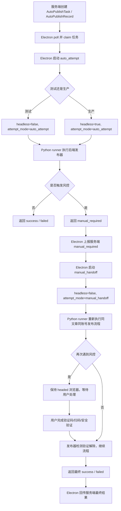

# 本地客户端发布风控双阶段执行方案

## 1. 目标

本文用于指导实现 AutoGeo 本地客户端发布链路中的风控处理。

当前架构是：

```text
服务端创建发布任务
-> Electron 本地客户端领取任务
-> Electron 启动 Python runner
-> Python runner 在客户端本机启动 Playwright 浏览器
-> Python runner 复用 backend/services/playwright/publishers 的后端发布逻辑
-> Electron 回传发布结果给服务端
```

生产环境默认希望第一阶段使用 headless 自动发布；当前测试阶段为了观察过程，第一阶段临时使用 headed。但测试阶段必须模拟生产阶段的状态机：第一阶段即使是 headed，也要按 `auto_attempt` 语义处理。

核心目标：

- 测试阶段和生产阶段只差第一阶段的浏览器可见性。
- 风控处理逻辑不依赖 `headless=true/false`，只依赖运行角色 `attempt_mode`。
- 第一阶段遇到风控时，不等待人工，不硬扛，立即进入 `manual_required`。
- 第二阶段启动 headed 人工接管流程，让用户可见地完成验证。
- 人工验证完成后继续同一篇文章、同一账号的发布，并回传最终结果。

## 2. 核心概念

必须把两个概念分开：

| 概念 | 含义 | 可选值 |
| --- | --- | --- |
| 浏览器可见性 | 浏览器是否显示给用户 | `headless=true/false` |
| 发布运行角色 | 当前尝试在状态机里的职责 | `auto_attempt/manual_handoff` |

不要写成：

```text
if headless:
    遇到风控立即返回
else:
    遇到风控等待人工
```

应该写成：

```text
if attempt_mode == "auto_attempt":
    遇到风控立即返回 manual_required

if attempt_mode == "manual_handoff":
    遇到风控等待人工处理，处理完成后继续
```

## 3. 测试阶段与生产阶段的差异

### 3.1 测试阶段

测试阶段第一阶段使用 headed，便于观察自动发布过程：

```json
{
  "attempt_mode": "auto_attempt",
  "headless": false
}
```

如果第一阶段遇到风控，不允许用户直接在这个窗口里处理。它要模拟生产 headless 行为：

```text
检测到风控 -> 立即返回 manual_required -> 结束第一阶段 -> 启动第二阶段 headed handoff
```

第二阶段永远 headed：

```json
{
  "attempt_mode": "manual_handoff",
  "headless": false
}
```

### 3.2 生产阶段

生产阶段第一阶段使用 headless：

```json
{
  "attempt_mode": "auto_attempt",
  "headless": true
}
```

第二阶段仍然 headed：

```json
{
  "attempt_mode": "manual_handoff",
  "headless": false
}
```

### 3.3 结论

测试和生产的差异应该只在：

```text
auto_attempt.headless = false  # 测试
auto_attempt.headless = true   # 生产
```

其余代码路径、风控判断、状态转换、人工接管流程都应一致。

## 4. 新发布流程

完整流程如下：



## 5. 状态机

建议状态语义如下：

```text
pending
-> publishing_auto
-> manual_required
-> publishing_handoff
-> success / failed
```

服务端现有状态可以继续使用现有字符串，但语义必须调整：

| 状态 | 语义 |
| --- | --- |
| `pending` | 等待客户端领取 |
| `publishing` | 当前正在执行自动尝试或人工接管尝试 |
| `manual_required` | 第一阶段检测到风控，等待/正在启动人工接管 |
| `success` | 子记录最终成功 |
| `failed` | 子记录最终失败 |

重要要求：

`manual_required` 不能被当成不可再变更的最终终态。人工接管成功后，同一个 `AutoPublishRecord` 必须能从 `manual_required` 转为 `success` 或 `failed`。

## 6. 服务端结果上报规则

### 6.1 第一阶段检测到风控

Electron 收到 auto_attempt 的 `manual_required` 结果后，上报：

```text
POST /api/client/publish/tasks/{task_id}/result
status = manual_required
record_id = 当前 record
error_msg = 风控原因
```

服务端应写入：

```text
AutoPublishTask.status = manual_required
AutoPublishTask.manual_required = true
AutoPublishTask.manual_message = message

AutoPublishRecord.status = manual_required
AutoPublishRecord.error_msg = message
```

不要增加 `failed_count`，不要把文章标记为 `failed`。

### 6.2 第二阶段开始人工接管

Electron 启动 `manual_handoff` 前，建议调用一个恢复/继续接口，或在现有 result 接口中允许状态回退：

```text
AutoPublishTask.status = running
AutoPublishTask.manual_required = false

AutoPublishRecord.status = publishing
```

如果短期不新增接口，也必须确保最终回传 `success/failed` 时，服务端允许：

```text
manual_required -> success
manual_required -> failed
```

当前 `backend/api/client_publish.py` 中 `RECORD_TERMINAL` 包含 `manual_required`，并且 `report_result` 对已终态记录不会重复计数。GLM 实施时必须修正这一点，否则人工接管成功后最终结果会被忽略。

建议调整：

```text
success/failed/skipped 是结算终态
manual_required 是暂停态，不是结算终态
```

或者在 `report_result` 中显式允许：

```text
if record.status == "manual_required" and request.status in {"success", "failed"}:
    允许覆盖并计数
```

### 6.3 第二阶段最终成功

回传：

```text
status = success
platform_url = 平台 URL
```

服务端写入：

```text
AutoPublishRecord.status = success
AutoPublishRecord.platform_url = platform_url
AutoPublishRecord.completed_at = now
AutoPublishTask.completed_count += 1
GeoArticle.publish_status = published
```

### 6.4 第二阶段最终失败

回传：

```text
status = failed
error_msg = 最终失败原因
```

服务端写入：

```text
AutoPublishRecord.status = failed
AutoPublishRecord.error_msg = error_msg
AutoPublishRecord.completed_at = now
AutoPublishTask.failed_count += 1
GeoArticle.publish_status = failed
```

## 7. Python runner 改造

目标文件：

- `backend/scripts/local_client_publish_runner.py`
- `backend/services/playwright/publishers/base.py`
- `backend/services/playwright/manual_guard.py`
- `backend/services/playwright/risk_detector.py`

### 7.1 payload 增加 attempt_mode

runner 输入 payload 增加字段：

```json
{
  "platform": "douyin",
  "article": {},
  "account": {},
  "storage_state_path": "...",
  "headless": false,
  "attempt_mode": "auto_attempt"
}
```

合法值：

```text
auto_attempt
manual_handoff
```

默认值建议：

```text
attempt_mode = "auto_attempt"
```

### 7.2 BasePublisher 增加运行角色

在 `BasePublisher` 中增加：

```python
self.attempt_mode = "auto_attempt"

def set_attempt_mode(self, mode: str) -> None:
    self.attempt_mode = mode if mode in {"auto_attempt", "manual_handoff"} else "auto_attempt"

def is_manual_handoff(self) -> bool:
    return self.attempt_mode == "manual_handoff"
```

runner 获取 publisher 后调用：

```python
if hasattr(publisher, "set_attempt_mode"):
    publisher.set_attempt_mode(attempt_mode)
```

### 7.3 风控检测行为按 attempt_mode 分流

修改 `BasePublisher.detect_manual_intervention` 和 `BasePublisher.ensure_publish_can_continue`：

当 `attempt_mode == "auto_attempt"`：

```text
调用 ensure_no_manual_challenge(wait_for_resolution=False)
如果检测到风控，立即返回 manual_required 结果
不等待人工处理
```

当 `attempt_mode == "manual_handoff"`：

```text
调用 ensure_no_manual_challenge(wait_for_resolution=True)
检测到风控后 bring_to_front
等待用户处理
验证解除后返回 None，发布流程继续
等待超时才返回 manual_required/manual_timeout
```

### 7.4 manual_guard 结果区分

当前 `manual_timeout_result` 总是表达超时。建议新增：

```python
def manual_required_result(resolution: ManualResolution) -> dict[str, Any]:
    return {
        "success": False,
        "manual_required": True,
        "manual_timeout": False,
        "requires_manual_intervention": True,
        "error_code": detection.error_code,
        "risk_type": detection.risk_type,
        "platform_url": detection.page_url,
        "error_msg": "平台要求人工验证，请切换到可见浏览器处理。",
    }
```

`auto_attempt` 使用 `manual_required_result`。

`manual_handoff` 等待超时后才使用 `manual_timeout_result`。

### 7.5 结构化事件输出

Python runner 可以保留 stderr 日志，同时建议输出结构化事件，方便 Electron 实时感知：

```text
__AUTO_GEO_EVENT__ {"type":"manual_required","platform":"douyin","stage":"wait_result","risk_type":"sms_verify_required","message":"抖音要求短信验证码"}
__AUTO_GEO_EVENT__ {"type":"manual_resolved","platform":"douyin","stage":"wait_result"}
__AUTO_GEO_EVENT__ {"type":"manual_timeout","platform":"douyin","stage":"wait_result"}
```

短期如果第一阶段立即返回 JSON，结构化事件不是必须；但第二阶段 headed handoff 等待人工时，结构化事件能让 UI 显示更及时。

## 8. Electron 改造

目标文件：

- `frontend/electron/main/backend-publisher-runner.ts`
- `frontend/electron/main/publish-engine.ts`
- `frontend/electron/main/task-api-client.ts`
- `frontend/electron/main/ipc-handlers.ts`

### 8.1 runBackendPublisher 增加 options

当前：

```ts
options: { headless?: boolean; timeoutMs?: number }
```

建议改为：

```ts
type AttemptMode = 'auto_attempt' | 'manual_handoff'

options: {
  headless?: boolean
  timeoutMs?: number
  attemptMode?: AttemptMode
  onEvent?: (event: BackendPublisherEvent) => void
}
```

写入 payload：

```ts
{
  platform,
  article,
  account,
  storage_state_path: getSessionPath(platform),
  headless: options.headless === true,
  attempt_mode: options.attemptMode || 'auto_attempt',
}
```

### 8.2 解析结构化事件

读取 child stderr 时，如果行以 `__AUTO_GEO_EVENT__ ` 开头：

```ts
const payload = JSON.parse(line.slice('__AUTO_GEO_EVENT__ '.length))
options.onEvent?.(payload)
```

普通日志继续输出：

```ts
console.log(`[BackendPublisher:${platform}] ${line}`)
```

### 8.3 超时策略

建议：

```text
auto_attempt timeout = 180 秒
manual_handoff timeout = 30 分钟或不超时
```

配置项：

```text
AUTO_GEO_AUTO_ATTEMPT_TIMEOUT_MS=180000
AUTO_GEO_MANUAL_HANDOFF_TIMEOUT_MS=1800000
```

如果 `timeoutMs <= 0`，则不设置 timer。

### 8.4 publish-engine 双阶段执行

伪代码：

```ts
const testAutoHeaded = process.env.AUTO_GEO_AUTO_ATTEMPT_HEADLESS === 'false'

const autoAttempt = await runBackendPublisher(platform, article, account, {
  attemptMode: 'auto_attempt',
  headless: !testAutoHeaded,
  timeoutMs: AUTO_ATTEMPT_TIMEOUT_MS,
})

if (autoAttempt.manual_required) {
  await apiClient.reportResult(taskId, recordId, 'manual_required', undefined, autoAttempt.manual_reason)
  onEngineStatus?.('manual_required')
  onManualRequired?.({ taskId, recordId, platform, message: autoAttempt.manual_reason })

  await apiClient.resumeManualRecord(taskId, recordId) // 推荐新增；短期可在最终 result 中兼容

  const handoffAttempt = await runBackendPublisher(platform, article, account, {
    attemptMode: 'manual_handoff',
    headless: false,
    timeoutMs: MANUAL_HANDOFF_TIMEOUT_MS,
    onEvent: handleManualEvent,
  })

  return reportFinal(handoffAttempt)
}

return reportFinal(autoAttempt)
```

测试阶段：

```text
AUTO_GEO_AUTO_ATTEMPT_HEADLESS=false
```

生产阶段：

```text
AUTO_GEO_AUTO_ATTEMPT_HEADLESS=true
```

或者默认生产 `true`，开发环境默认 `false`。

## 9. 服务端 API 改造

目标文件：

- `backend/api/client_publish.py`
- `backend/api/auto_publish.py`

### 9.1 manual_required 不应是结算终态

当前：

```python
RECORD_TERMINAL = {"success", "failed", "skipped", "manual_required"}
```

建议改为：

```python
RECORD_SETTLED_TERMINAL = {"success", "failed", "skipped"}
RECORD_PAUSED = {"manual_required"}
```

如果为了兼容暂不改常量，也必须在 `report_result` 中允许：

```python
manual_required -> success
manual_required -> failed
```

### 9.2 manual_required 上报时设置 task.status

当前 `client_publish.report_result` 对 `manual_required` 设置了 `task.manual_required`，但应确认同时设置：

```python
task.status = "manual_required"
```

这样前端和轮询状态更清晰。

### 9.3 新增恢复接口

建议新增：

```text
POST /api/client/publish/tasks/{task_id}/records/{record_id}/resume-manual
```

作用：

```text
manual_required -> publishing
task.status = running
task.manual_required = false
record.status = publishing
claim 仍归当前 device
```

如果不新增接口，则最终 `success/failed` 上报必须能从 `manual_required` 覆盖过去。

### 9.4 幂等保护

创建新任务时，`manual_required` 不应阻止用户重新发布。这个逻辑已在 `backend/api/auto_publish.py` 方向上调整过，GLM 需要确认最终代码中：

```text
duplicate_record_statuses 不包含 manual_required
```

## 10. 发布器接入要求

目标平台：

- 知乎：`zhihu`
- 快手：`kuaishou`
- 抖音：`douyin`
- 百家号：`baijiahao`
- B站：`bilibili`
- 简书：`jianshu`
- 头条号：`toutiao`，当前注册到 `ToutiaoProPublisher`
- CSDN：`csdn`

### 10.1 通用能力是否能同时起作用

双阶段执行、runner 参数、Electron 状态机、服务端状态转换是平台无关的。只要平台走 `runBackendPublisher -> local_client_publish_runner.py -> backend/services/playwright/publishers`，就会同时受益。

但每个平台是否能准确进入 `manual_required`，取决于两个条件：

1. 发布器是否在关键阶段调用了 `detect_manual_intervention` 或 `ensure_publish_can_continue`。
2. `risk_detector.py` 是否能识别该平台的验证码、扫码、登录失效、风控 DOM。

因此这个方案分两层：

| 层级 | 是否平台通用 | 说明 |
| --- | --- | --- |
| Electron 双阶段执行 | 是 | 所有平台统一 |
| Python runner `attempt_mode` | 是 | 所有平台统一 |
| BasePublisher 分流策略 | 是 | 所有继承 BasePublisher 的平台统一 |
| 风控 DOM 识别 | 部分通用 | 通用规则覆盖大部分，平台特殊弹窗需要补规则 |
| 发布器关键阶段调用检测 | 需要逐平台确认 | 没调用检测的发布器需要补点 |

### 10.2 平台当前接入检查

根据当前代码搜索结果：

| 平台 | ID | 当前情况 | GLM 需要做的事 |
| --- | --- | --- | --- |
| 知乎 | `zhihu` | 未在搜索结果中看到明显 `detect_manual_intervention/ensure_publish_can_continue` 调用 | 需要补导航后、发布前、wait_result 中的人工检测 |
| 快手 | `kuaishou` | 未看到人工检测调用，wait_result 目前主要超时失败 | 需要补导航后、发布后 wait_result 人工检测 |
| 抖音 | `douyin` | 已在 wait_result 接入 `ensure_publish_can_continue` | 改为按 `attempt_mode` 分流，auto_attempt 立即返回，manual_handoff 等待 |
| 百家号 | `baijiahao` | 多处已有 `detect_manual_intervention` | 确认 BasePublisher 分流后行为正确；补漏 wait_result 检测点 |
| B站 | `bilibili` | 已有登录/安全验证检测和 `_manual_fail` | 确认 wait_result 也走统一检测或平台限流检测返回 manual_required |
| 简书 | `jianshu` | 有自定义 `_detect_manual_checkpoint` | 建议改为调用 BasePublisher 统一能力，或让自定义检测也遵守 `attempt_mode` |
| 头条号 | `toutiao` / `toutiaopro` | `toutiao` 当前注册到 `ToutiaoProPublisher`，已有 wait_result 人工检测 | 确认 BasePublisher 分流后行为正确 |
| CSDN | `csdn` | 已有 `ensure_publish_can_continue` | 确认 BasePublisher 分流后行为正确 |

### 10.3 每个平台必须覆盖的检测点

每个平台发布器至少在以下阶段检测：

```text
1. 导航后 / 编辑器 ready 前
2. 登录态检查后
3. 上传图片后
4. 点击发布前
5. 点击发布后 / 二次确认后
6. wait_result 循环内
```

尤其是第 6 点。抖音之前的问题就是点击发布后弹验证码，但 wait_result 只等成功/失败提示，导致最终超时失败。

## 11. UI 行为

### 11.1 第一阶段风控

Electron 收到 auto_attempt 的 `manual_required` 后，UI 显示：

```text
平台触发验证，正在为你打开人工接管浏览器...
平台：抖音
账号：xxx
文章：xxx
```

### 11.2 第二阶段人工接管

headed handoff 浏览器打开后，UI 显示：

```text
请在已打开的浏览器中完成平台验证。
完成后系统会自动继续发布。
```

按钮：

```text
取消接管
我已完成，立即检测
```

短期可以不实现“我已完成”按钮，靠 Python 轮询检测验证解除；长期建议实现立即检测事件。

## 12. 超时与取消

### 12.1 auto_attempt

保留短超时：

```text
180 秒
```

超时结果：

```text
failed
error_msg = 自动发布尝试超时
```

### 12.2 manual_handoff

使用长超时或不超时：

```text
建议 30 分钟，或配置为 0 表示不超时
```

超时结果：

```text
manual_timeout
可映射为 manual_required 或 failed_manual_timeout
```

推荐短期处理为：

```text
status = manual_required
message = 人工验证等待超时，请重新接管或取消任务
```

不要映射成普通 `后端发布器执行超时 (180s)`。

## 13. 验收用例

### 13.1 测试阶段 auto_attempt headed

配置：

```text
AUTO_GEO_AUTO_ATTEMPT_HEADLESS=false
```

步骤：

```text
1. 创建抖音发布任务
2. 第一阶段打开可见浏览器
3. 平台弹验证码
4. 系统不能在第一阶段等待用户处理
5. 第一阶段返回 manual_required
6. Electron 上报 manual_required
7. 第二阶段重新打开 headed handoff
8. 用户在第二阶段浏览器处理验证码
9. 发布继续并最终 success/failed
```

### 13.2 生产阶段 auto_attempt headless

配置：

```text
AUTO_GEO_AUTO_ATTEMPT_HEADLESS=true
```

步骤：

```text
1. 创建同类任务
2. 第一阶段无可见浏览器
3. 检测到验证码后立即 manual_required
4. 第二阶段打开可见浏览器
5. 用户完成验证
6. 发布继续并最终 success/failed
```

### 13.3 无风控路径

```text
auto_attempt 直接发布成功
不启动 manual_handoff
服务端记录 success
```

### 13.4 人工接管成功后服务端计数

```text
manual_required -> success
completed_count 必须 +1
failed_count 不变
GeoArticle.publish_status = published
```

### 13.5 人工接管失败后服务端计数

```text
manual_required -> failed
failed_count 必须 +1
GeoArticle.publish_status = failed
```

## 14. 实施顺序建议

1. `BasePublisher` 增加 `attempt_mode`。
2. `manual_guard` 增加 `manual_required_result`。
3. 修改 `detect_manual_intervention` / `ensure_publish_can_continue` 按 `attempt_mode` 分流。
4. `local_client_publish_runner.py` 接收并设置 `attempt_mode`。
5. `backend-publisher-runner.ts` 传递 `attemptMode` 和不同 timeout。
6. `publish-engine.ts` 实现 auto_attempt -> manual_handoff 双阶段。
7. `client_publish.py` 修正 `manual_required` 后续可转 `success/failed`。
8. 补齐知乎、快手等缺少人工检测点的平台发布器。
9. 增加 UI 提示和取消按钮。
10. 按 8 个目标平台逐个回归。

## 15. 结论

最终方案不是“根据 headless/headed 决定风控处理”，而是“根据运行角色决定风控处理”。

测试阶段：

```text
auto_attempt: headed 但遇到风控立即返回 manual_required
manual_handoff: headed 并等待用户处理
```

生产阶段：

```text
auto_attempt: headless 且遇到风控立即返回 manual_required
manual_handoff: headed 并等待用户处理
```

这样测试阶段与生产阶段只差 `auto_attempt.headless` 这一个参数，核心代码逻辑保持一致。该方案的框架层面适用于知乎、快手、抖音、百家号、B站、简书、头条号、CSDN；但每个平台发布器仍需要确认关键阶段调用统一人工检测，并为平台特有风控弹窗补充识别规则。
